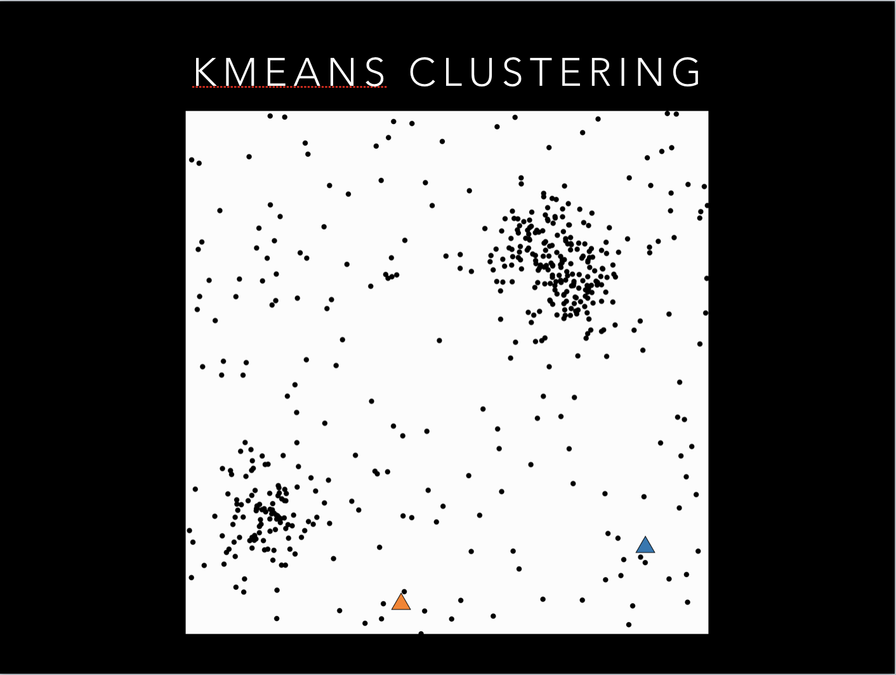
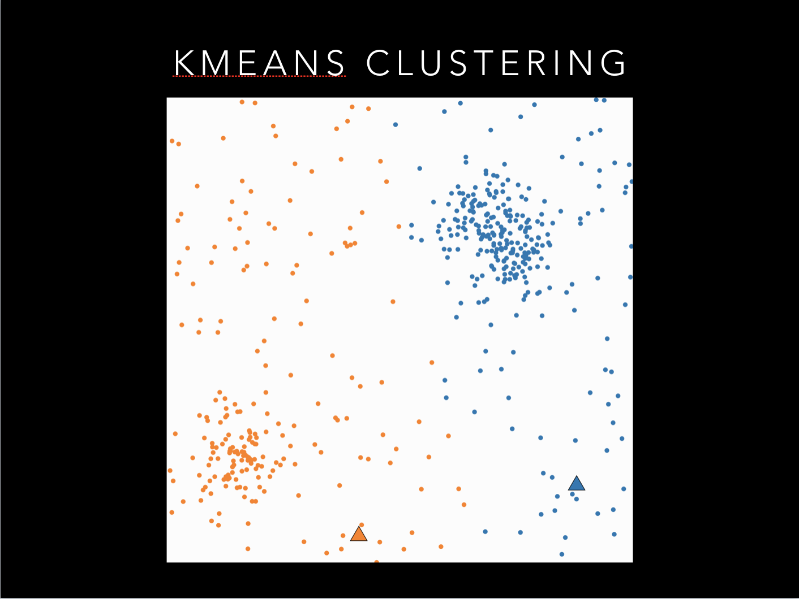
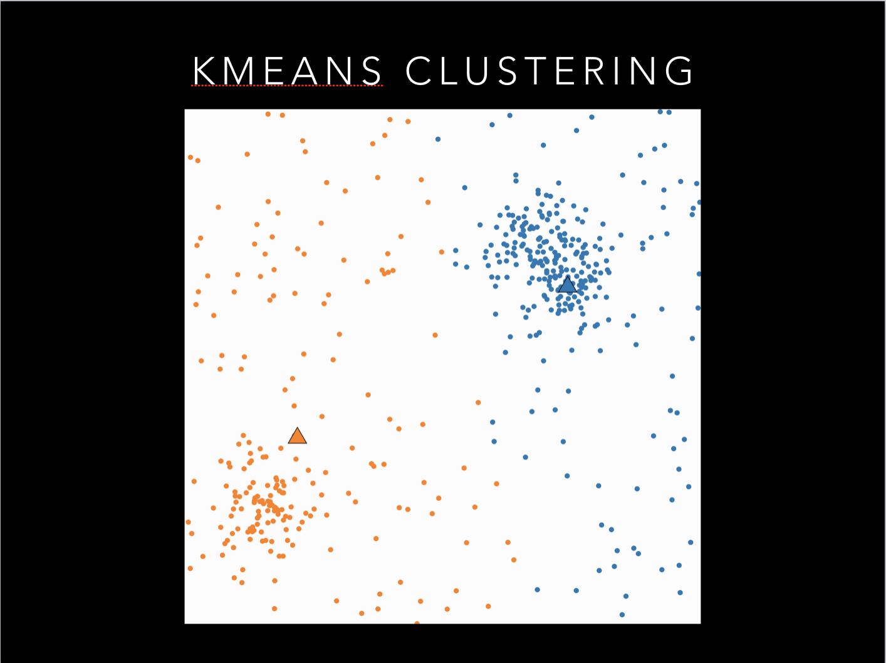
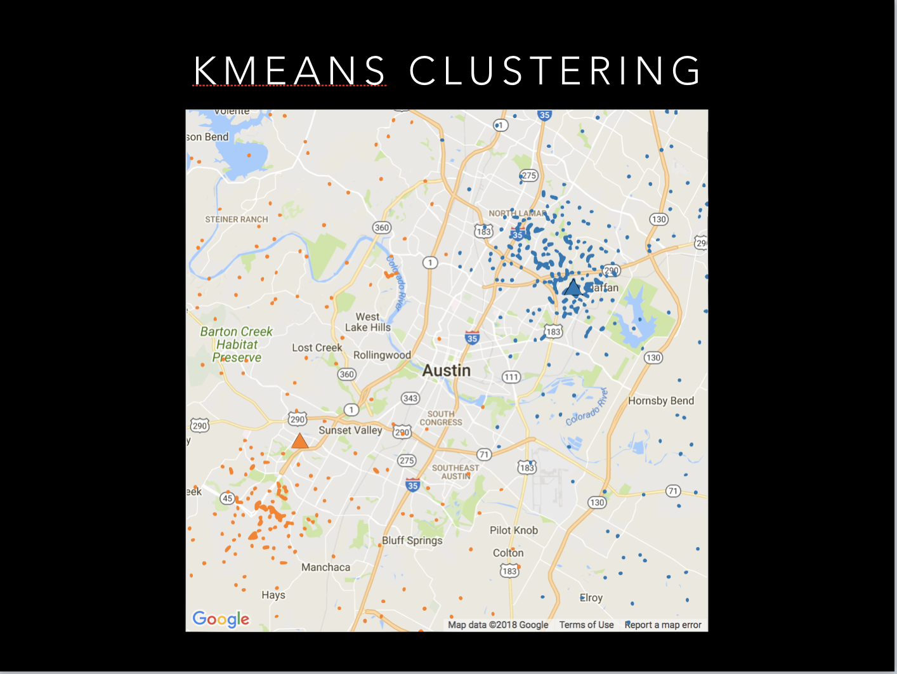
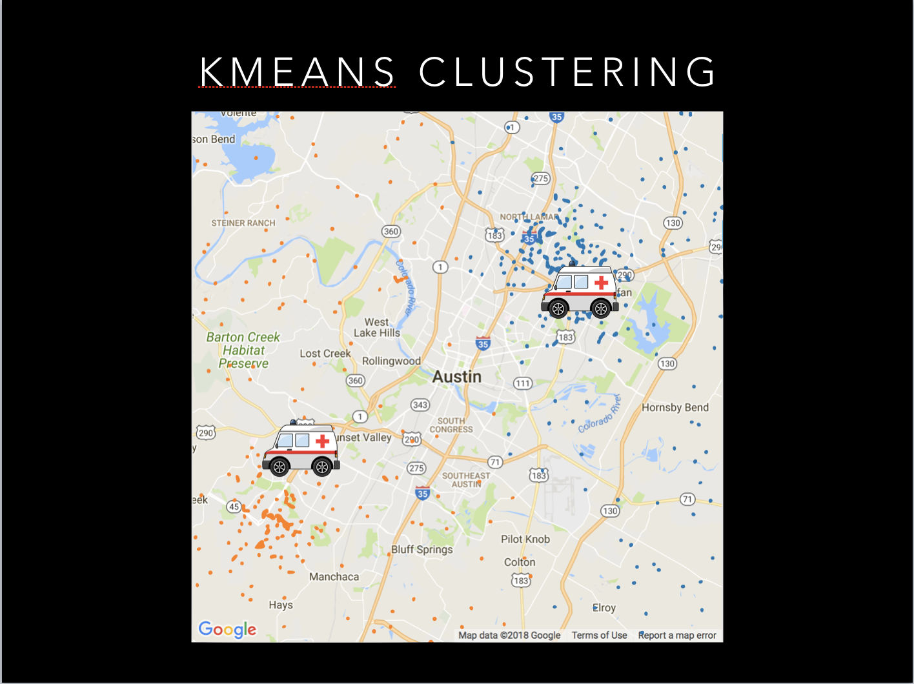
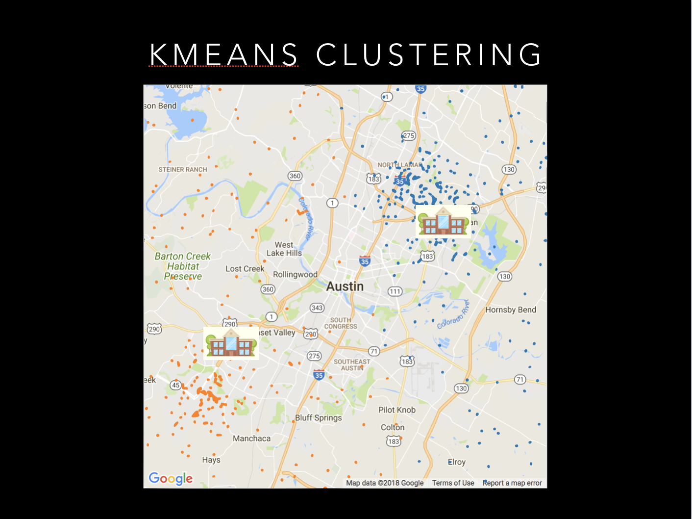
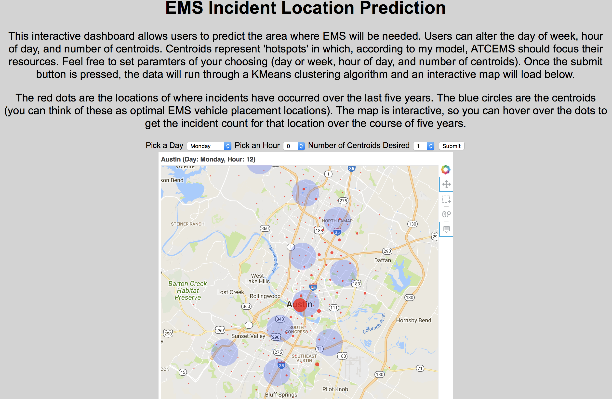
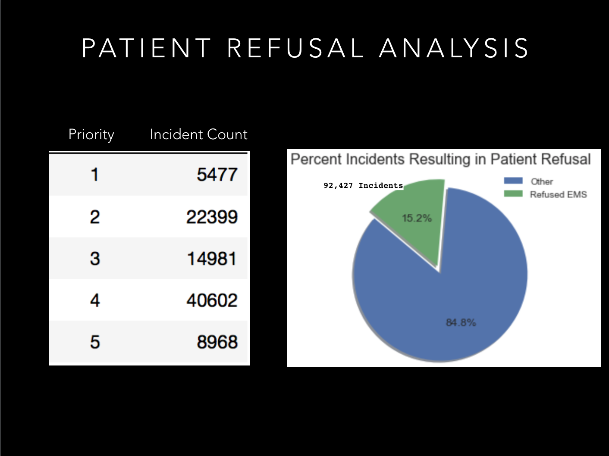
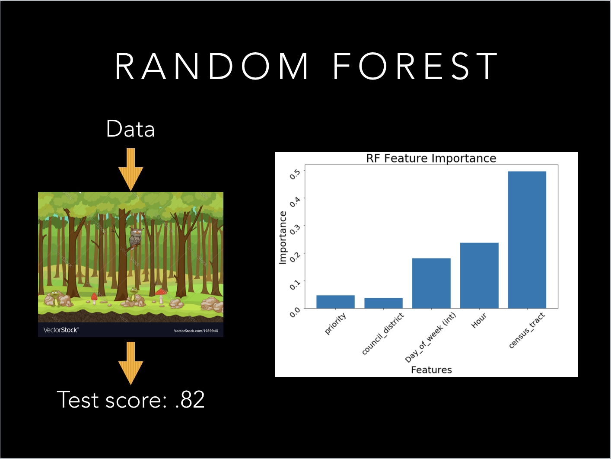

# Improving Austin EMS

## Repository Guide

Hello and thanks for checking out my project! This home page that your on right now contains the code I wrote for the
interactive Flask Web App I created. If you want to see the the 'meat and potatoes' of this project please click the
folder titled 'meat_and_potatoes.' Thanks again for visiting!

## High level Summary

Have you ever seen the movie 'Minority Report.' If not, don't worry, it's fairly easy to explain the premise. In the
movie, Tom Cruise plays a detective from the future who through the use of psychics is able to predict when and where
a crime will take place before a crime is committed. In a nutshell, Tom Cruise can predict the future.

For the purposes of this project, I thought of myself as Tom Cruise. Instead of predicting crime before it happens I'm
trying to predict where EMS services will be needed before a person calls 911. And instead of using psychics to predict
the future I'm using machine learning algorithms. Specifically, I'm using something called a KMeans Clustering algorithm.

I hope the prospect of predicting the future and possibly saving lives has peaked your interest. If so, please feel free
to keep on reading!

## Overview

In the City of Austin alone, there are over one-hundred thousand EMS dispatches per year (and every year that number is
increasing). In a number of these scenarios, a matter of minutes could be the difference between life and death.
My goal for this project was to create a machine learning model that could possibly help reduce response times. In order
to do that, I sought out to create a model that could predict where an incident would occur before it occurred.

To provide a little more detail, it was my objective to predict 'hot-spots' of where EMS vehicles will be needed based
on the hour of the day and the day of the week.

In addition to this model, I discovered (over the course of my exploratory data analysis) that roughly 1/6 of the
population being tended to by EMS personal refused a trip to the hospital. I set out to understand that refusal and
furthermore to predict when individuals were likely to refuse EMS transport.

## Dataset

The dataset for this project was provided by the City of Austin. The data stretches back five years and provides
incident block location, disposition, and time unit arrived among various other fields. With over 640k
rows and twenty-five features in one EMS dataset alone, I was able to filter the data down significantly without losing
predictive power in my model.

To the City of Austin, specifically ATCEMS, a very big thank you! I hope my analysis helps you in any way, shape, or
form.

## Model Selection

EMS response location data is highly sensitive information. With a specific data (timestamp, Latitude and Longitude) one
can conceivably deduce the identity of the person being tended to. To de-identify the information, The City of Austin
provided census-block location data rather than specific latitude, longitude. Because of the nature of the location
data, I felt the most appropriate model was a KMeans Clustering algorithm.

To illustrate how the algorithm works I've provided a step-by-by guide below (with pictures).

## KMeans Clustering Explained (and how it can improve EMS services)

### Step 1

I want you to take a look at the picture below with the white backdrop and randomly placed points. If I asked you to
separate these points into two groups you could do this fairly easily. With K-Means clustering, a computer will attempt
to do this using something called centroids.

### Step 2

Because we believe this data can best be split by assigning two groups, we will tell the algorithm to assign two
centroids (more on what a centroid is later). Here our centroids are represented by orange and blue triangles. The
computer first randomly plots the centroids (pictured below).

### Step 3

The computer then does an initial grouping based on the randomly selected centroid locations. The goal of a centroid is
to find the center (hence the name centroid) of the clusters, and as you can see, our triangles are far from the center
of each cluster. As seen below, a portion of the points are categorized as blue as the other portion as orange.

### Step 4

As stated before, the goal of the centroid is to find the center of each cluster. The computer accomplishes this feat
by iteratively moving the centroids until the center of the clusters is found.

So we found the center of our clusters. That's great but how does this help us predict EMS demand throughout the city of
Austin? Now instead of these being randomly placed points I want you to imagine these as precise locations for where
ambulances have been sent to. And to make it more understandable, let’s overlay these incident points over a map of
Austin.

Now this is more understandable. We have a map of Austin along with points that represent where an ambulance was sent.
But what do the centroids represent? For this project I want you to think of these triangles as ambulance
vehicles (pictured below).

If we can effectively cluster past incidents in Austin (broken up by hour of day, and day of week) then we can better
dispatch ambulance vehicles to locations where incidents are more likely to occur.

Furthermore, if we could look at trend data of where incidents are occurring year over year, then we could even think
of the centroids as possible locations to build new Ambulance stations (pictured below).

## The Web App

What good is an EMS demand prediction model if no one can use it? I created a simple to use web application (using flask)
so that EMS personnel could easily predict demand 'hotspots.' The web app works as follows:

* Pick a day of the week

* Pick an hour of the day

* Pick number of centroids desired (think of these as the number of EMS vehicles available at a particular time)

* Hoover over red dots (incident locations) to get a count of the incidents over the last five years

# Patient Refusal Prediction

As I was combing through my data I came across a feature called 'disposition'. I looked into it and saw one of the
values was 'patient refused.' What this means is that in a certain number of EMS response incidents the people being
tended to refuse service. This in itself was not surprising to me. I come think of a host of reasons why people would
refuse to ride to the hospital in an EMS vehicle. None the less I wanted to take a deeper dive into the data.

## A Deeper Dive Into the Data

I put together I pie chart to see the exact percentage of total incidents that resulted in a patient refusing EMS
services. As seen in the pie chart below, that percentage came out to 15.2% or roughly 92k cases. But what's
really interesting is that out of these 92k cases, most of them are being categorized between priority 1-4 (a priority
1 incident is the most urgent where as priority 5 is the least). My thought process was, if we can predict what patients
 will refuse EMS services then perhaps EMS can better prioritize their dispatches.

The next thing I did was figure out what features from the data I thought would be meaningful and I passed that through
a model called Random Forest Classifier.

It turns out that it's possible to predict which patients are likely to refuse (and I was able to correctly make that
prediction 82% of the time). As seen in the picture below, the most import features that determine if a patient is going
to refuse EMS service is the hour of the day and the census tract in which they live.

Now by no means am I suggesting that if a patient is predicted to refuse EMS service should their priority level
immediately be bumped down to a 5. That would be a reckless way to interpret the findings of my model. What the model
results show is that there are certain locations in Austin that refuse service more than others. Whether it's because
certain communities don't trust EMS or it's simply too expensive, the point is there are areas of Austin where EMS
service needs to better address a communities' specific needs.

# Future Work and Challenges

Specifically I would like to know in what areas are people refusing ambulance services most. In the future I would like
to gather additional information from the city of Austin to do a deeper dive into.

This project came together well, but not without significant challenges. The incident location data I was given was
actually grouped into something called census tracts (think of these as zip codes but a little more specific to location).
This means that my model was predicting areas in which an incident was likely to occur rather than specific locations.
Precise EMS response location data is hihgly sensitive information so it's understandable why Austin EMS couldn't
provide it. If I could work with the city under the agreement that all location data would be kept secret then I’m sure
 I can create a better clustering algorithm.

# Thank You!

Thank for reading this far into my project and I hope you found it interesting!

Thanks again to the city of ATCEMS for providing the data and I really hope this analysis helps you guys.

