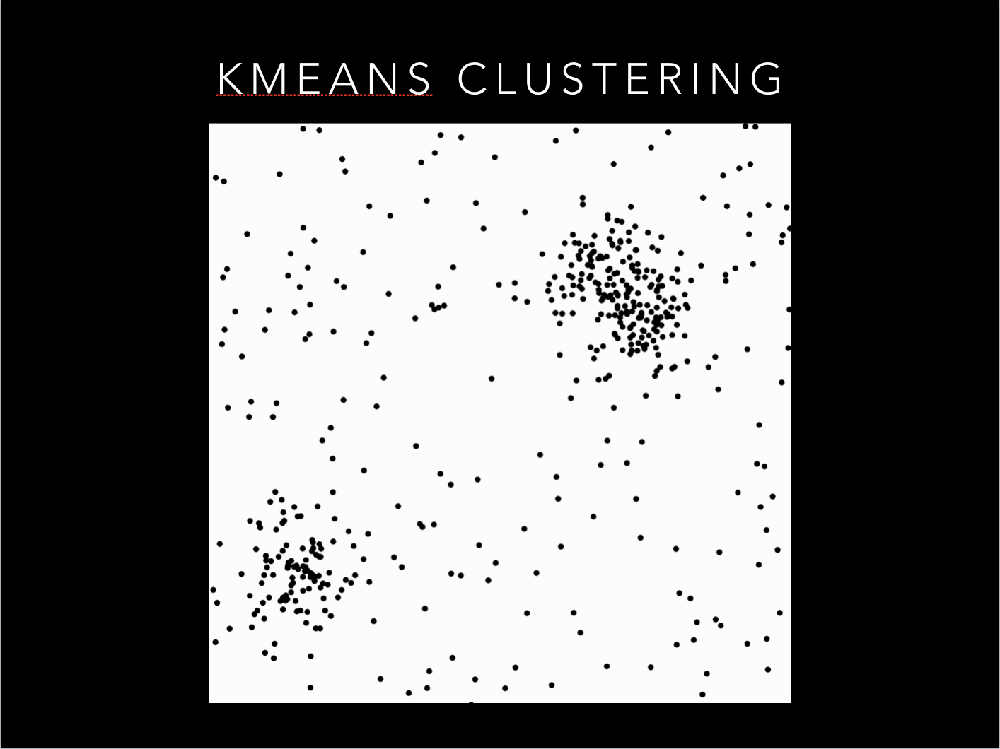

# Improving Austin EMS

## Repository Guide

Hello and thanks for checking out my project! This home page that your on right now contains the code I wrote for the
interactive Flask Web App I created. If you want to see the the 'meat and potatoes' of this project please click the
folder titled 'meat_and_potatoes.' Thanks again for visiting!

## High level Summary

Have you ever seen the movie 'Minority Report.' If not, don't worry, it's fairly easy to explain the premise. In the
movie, Tom Cruise plays a detective from the future who through the use of psychics is able to predict when and where
a crime will take place before a crime is committed. In a nutshell, Tom Cruise can predict the future.

For the purposes of this project, I thought of myself as Tom Cruise. Instead of predicting crime before it happens I'm
trying to predict where EMS services will be needed before a person calls 911. And instead of using psychics to predict
the future I'm using machine learning algorithms. Specifically, I'm using something called a KMeans Clustering algorithm.

I hope the prospect of predicting the future and possibly saving lives has peaked your interest. If so, please feel free
to keep on reading!

## Overview

In the City of Austin alone, there are over one-hundred thousand EMS dispatches per year (and every year that number is
increasing). In a number of these scenarios, a matter of minutes could be the difference between life and death.
My goal for this project was to create a machine learning model that could possibly help reduce response times. In order
to do that, I sought out to create a model that could predict where an incident would occur before it occurred.

To provide a little more detail, it was my objective to predict 'hot-spots' of where EMS vehicles will be needed based
on the hour of the day and the day of the week.

In addition to this model, I discovered (over the course of my exploratory data analysis) that roughly 1/6 of the
population being tended to by EMS personal refused a trip to the hospital. I set out to understand that refusal and
furthermore to predict when individuals were likely to refuse EMS transport.

## Dataset

The dataset for this project was provided by the City of Austin. The data stretches back five years and provides
incident block location, disposition, and time unit arrived among various other fields. With over 640k
rows and twenty-five features in one EMS dataset alone, I was able to filter the data down significantly without losing
predictive power in my model.

To the City of Austin, specifically ATCEMS, a very big thank you! I hope my analysis helps you in any way, shape, or
form.

## Model Selection

EMS response location data is highly sensitive information. With a specific data (timestamp, Latitude and Longitude) one
can conceivably deduce the identity of the person being tended to. To de-identify the information, The City of Austin
provided census-block location data rather than specific latitude, longitude. Because of the nature of the location
data, I felt the most appropriate model was a KMeans Clustering algorithm.

To illustrate how the algorithm works I've provided a step-by-by guide below (with pictures).

### KMeans Clustering Explained (and how it can improve EMS services)

I want you to take a look at the picture below with the white backdrop and randomly placed points. If I asked you to
separate these points into two groups you could do this fairly easily. With K-Means clustering, a computer will attempt
to do this using something called centroids.

## The Model

As stated above, I used a KMeans clustering algorithm for my model. For this particular KMeans model, I passed through
the coordinates of past events to try and determine 'hotspots' of where most incidents occur. What the KMeans classifier
does is it finds the center of those 'hotspots' (also known as centroids). The tricky part about KMeans is determining
the optimal number of 'hotspots' to tell the model to create. Using anywhere between seven to ten centroids gave me the
best results. I think of a centroid as an EMS vehicle or an EMS station. The City of Austin has more than ten EMS
vehicles but I wanted to see how much area I could cover with minimal centroids (EMS vehicles).

But I also wanted my model to be adaptable and useful for the City of Austin. As a result, I made the model customizable
and easy to use. The end result is a model that allows the user to input day of week, hour of day, and desired amount of
centroids and it outputs a map showing predicted 'hotspots' based on historical data.

## Patient Refusal Prediction

As I was combing through my data I came across a feature called 'disposition'. I looked into it and saw one of the
values was 'patient refused.' What this means is that in a certain number of EMS response incidents the people being
tended to refuse service. This in itself was not surprising to me. I come think of a host of reasons why people would
refuse to ride to the hospital in an EMS vehicle. None the less I wanted to take a deeper dive into the data.

### A Deeper Dive Into the Data

